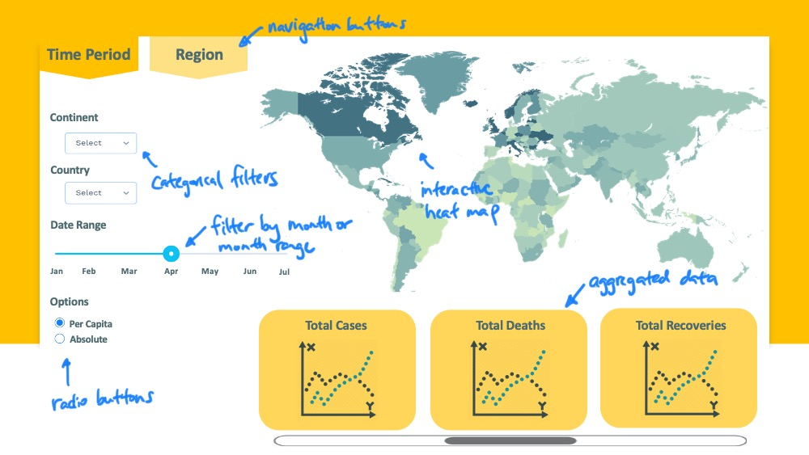

# DSCI532-Group3

Team Members: Sukhdeep Kaur, Arash Shamseddini, Tran Doan Khanh Vu, Heidi Ye

Dataset: COVID-19 [Dataset](https://www.kaggle.com/imdevskp/corona-virus-report?select=covid_19_clean_complete.csv)

App: COVID-19 [Dashboard](https://covid-19-mds-532-group3.herokuapp.com/)

## Welcome!
Hello and welcome to our COVID-19 Dashboard - an interactive app that allows users to explore COVID-19 confirmed cases, deaths and recoveries around the world. 

As the pandemic continues into 2021, the intent of this app is to allow users to examine the first seven months of 2020 to visualize how the pandemic progressed in the early stages. Users can view this data both on a global scale as well as on a region or country basis. The app also allows users to compare countries or regions across time periods to understand how different lockdown measures may have impacted these key measures.

### App Sketch

Here's an outline of the initial concept behind this app. 

The landing page consists of a world heatmap which highlights regions that have been most and least impacted by the virus. Users can select the continent, country and date range they are interested in by using the respective dropdown menus and sliders. There is also a further option to specify if they are interested in absolute or per capita data through the radio buttons below. Once these fields are filled out, the bottom of the page will populate several plots with aggregated data that the user can explore in greater detail. The scroll bar will allow them to view up to six plots. 

The top menu has a "Region" button which leads the user into a region comparison page. The main functionality of this page is to provide a more detailed look at region specific data once the user understands the global landscape. They can again, select a time period, but also two specific countries on the map. The two countries selected will be highlighted and some general raw data will be displayed for each country. Aggregated comparison data will be displayed along the bottom to give the user a more comprehensive understanding of the similarities and differences between the two regions. 

The intent of this app is for users to be able to explore both global trends as well as region by region comparisons in an iterative manner.    

## Get Involved

We are always looking for feedback and contributors! 

In second milestone, the main comparison functionality of the "Region" tab was incorporated into landing page to limit the scope of having to build two tabs. Potential functionality to add for the future include:

- ability to select countries on the map by clicking as a more intuitive alternative than typing in the country field
- exploring ways to speed up the page load time (loading widget currently implemented)

The next feature we are hoping to build is a second tab with all the features outlined in the app sketch image directly above. You can run the app locally and contribute by:
1. Forking this repo
2. Downloading the environment in the `environment.yaml` file
3. Adding your improvements to the `app.py` file in the `src` folder

